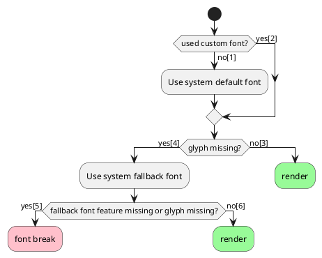

# Font breaking issue analysis

Problems:
1. Using fontconfig breaks route [1] > [3] for English language on Galaxy Watch.

    This is probably a bug. On Galxy Watch, fontconfig matches English text to Malayan font, which can't express Latin characters.

2. Not using fontconfig breaks route [2] > [4] > [5] for any language.

    This is due to unimplemented method; `SkFontMgr_Custom.onMatchFamilyStyleCharacter`.

Solving either one will fix the font breaking error:

1. Configure the fontconfig configuration file in `/etc/fonts` so that the system matches correct language font for English text. 

    This solution may only be feasible if Tizen user can modify files in that directory. Furthermore, it also requires understanding the tedius fontconfig configuration system to make the necessary changes.

2. Implement `SkFontMgr_Custom.onMatchFamilyStyleCharacter`.

    This solution will make changes to the skia code which is hard to maintain afterwards. Furthermore, implementing the function is not so simple.

Note that all other platforms(except Linux) have their own implementation of `SkFontMgr_Custom.onMatchFamilyStyleCharacter` in skia.